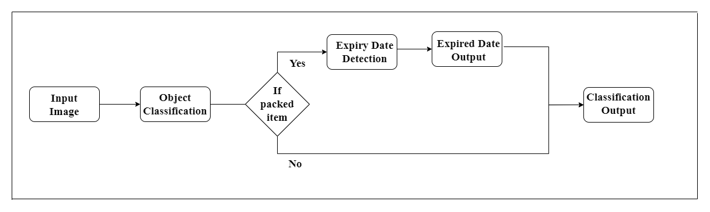

  CS-7641: Machine Learning - Group 43
  <b>Team Members:</b> Jaiswal Shivanee, Sama Sai Srikesh Reddy, Anugundanahalli Ramachandra Reshma, Sivakumar Nikhil Viswanath, Khochare Janavi

# Introduction and Background
Few products can last forever, more so food items. Expiration dates on products serve as an estimate for the healthy usage of the product. It is the date up to which food maintains its biological and physical stability. There are many cases where the information on the product label is hard to read and this is even more true in the case of a visually impaired person. With an increasing need to maintain the food quality standard, this remains an issue which needs to be tackled. 

For the scope of this project, we considered an image data set which has real images of various food, beverage and drugs consisting of 13 different date formats. Moreover, a custom dataset with synthetic images having dates similar to an actual product label is considered for building the model.  

# Problem Definition and Motivation
Many grocery products are similar in shape and texture, making it difficult for visually impaired people to identify them using touch. Also, they cannot read expiry dates of products, necessary to ensure safe consumption. Thus, we aim to create a system providing audio feedback to such people by identifying the grocery product and the best-before/expiry date if mentioned.

  	

# Method
The aim of this project is to: 
* Identify the product using object classification (supervised learning) 
* Extract the expiry date information on the packages (unsupervised learning) 

This object classification task is an image classification task based on Transfer Learning. The base CNN model (ResNet-45) is pretrained on the ImageNet dataset (due to its 1000+ images each for an extensive list of classes) and the weights obtained are used in further training the ResNet model on the custom dataset. 

  	

Using unsupervised learning, we can determine whether an item has expired or not by looking at images of the item. The full framework's architecture is depicted in Figure 1. Our framework is broken up into three sections. The feature extractor and the feature pyramid network (FPN) are used to extract the date region of the input image in the first section, which is referred to as date detection. The day, month, and year components are extracted from the date detection region, which is referred to as the Day-Month-Year Detection section. The third component is referred to as the Recognition Network, and this is where we apply the decoupling attention network (DAN) to recognize handwritten text. 

  	

# Potential Results and Discussion
Potential results include a comparative analysis of all classification models (ResNet-45/50/101, VGG-16, Inceptionv3, EfficientNet) trained and tested for identifying expiry dates and classifying items.  

Performance metrics used to evaluate the models will be balanced accuracy, precision, recall, f1-score, confusion matrix, ROC AUC and Top-k classification accuracy. 

A mobile application that demonstrates the working of the models could also be designed. Further, this work can be extended towards the development of a scanner that can help the visually impaired in a potential lifesaving situation – as in the case of detecting expired medicines. 

# Reference
1. Ahmet Cagatay Seker, Sang Chul Ahn “A generalized framework for recognition of expiration dates on product packages using fully convolutional networks”, Expert Systems with Applications, Volume 203, 2022, 117310, ISSN 0957-4174, [https://doi.org/10.1016/j.eswa.2022.117310](https://doi.org/10.1016/j.eswa.2022.117310). 
2. Minyoung Huh, Pulkit Agrawal, Alexei A. Efros, “What makes ImageNet good for transfer learning?”, [https://doi.org/10.48550/arXiv.1608.08614](https://doi.org/10.48550/arXiv.1608.08614).
3. E. Peng, P. Peursum and L. Li, "Product Barcode and Expiry Date Detection for the Visually Impaired Using a Smartphone," 2012 International Conference on Digital Image Computing Techniques and Applications (DICTA), 2012, pp. 1-7, doi: 10.1109/DICTA.2012.6411673. 
4. Ashino, M., Takeuchi, Y. (2020). Expiry-Date Recognition System Using Combination of Deep Neural Networks for Visually Impaired. In: Miesenberger, K., Manduchi, R., Covarrubias Rodriguez, M., Peňáz, P. (eds) Computers Helping People with Special Needs. ICCHP 2020. Lecture Notes in Computer Science, vol 12376. Springer, Cham. [https://doi.org/10.1007/978-3-030-58796-3_58](https://doi.org/10.1007/978-3-030-58796-3_58).

# Gantt Chart and Proposed Timeline
[View File](https://gtvault-my.sharepoint.com/:x:/g/personal/rramachandra7_gatech_edu/Ecd-YPwCuFBDuvu44UX_7J0B0jfClvfIibe9kC5hi7yXXw?e=a2dXz0)

# Contribution Table

<table class="tg">
<thead>
  <tr>
    <th class="tg-7btt">Name</th>
    <th class="tg-7btt">Project Task</th>
  </tr>
</thead>
<tbody>
  <tr>
    <td class="tg-c3ow" rowspan="5">Shivanee Jaiswal </td>
    <td class="tg-0pky">Problem Definition and Github Page for project proposal</td>
  </tr>
  <tr>
    <td class="tg-0pky">Model Selection for supervised learning </td>
  </tr>
  <tr>
    <td class="tg-0pky">Model Selection and coding for unsupervised learning </td>
  </tr>
  <tr>
    <td class="tg-0pky">Testing and Analysis </td>
  </tr>
  <tr>
    <td class="tg-0pky">Evaluation </td>
  </tr>
  <tr>
    <td class="tg-c3ow" rowspan="5">Reshma Ramachandra </td>
    <td class="tg-0pky">Potential Results and Discussion for proposal </td>
  </tr>
  <tr>
    <td class="tg-0pky">Model coding for supervised learning </td>
  </tr>
  <tr>
    <td class="tg-0pky">Data preprocessing for unsupervised learning </td>
  </tr>
  <tr>
    <td class="tg-0pky">UI Integration </td>
  </tr>
  <tr>
    <td class="tg-0pky">Evaluation </td>
  </tr>
  <tr>
    <td class="tg-c3ow" rowspan="5">Janavi Khochare </td>
    <td class="tg-0pky">Method for project proposal </td>
  </tr>
  <tr>
    <td class="tg-0pky">Model coding for supervised learning </td>
  </tr>
  <tr>
    <td class="tg-0pky">Result evaluation and analysis for unsupervised learning </td>
  </tr>
  <tr>
    <td class="tg-0pky">Testing and analysis </td>
  </tr>
  <tr>
    <td class="tg-0pky">Evaluation </td>
  </tr>
  <tr>
    <td class="tg-c3ow" rowspan="5">Srikesh Reddy </td>
    <td class="tg-0pky">Introduction and background for project proposal </td>
  </tr>
  <tr>
    <td class="tg-0pky">Data sourcing and cleaning for supervised learning </td>
  </tr>
  <tr>
    <td class="tg-0pky">Data sourcing and cleaning for unsupervised learning </td>
  </tr>
  <tr>
    <td class="tg-0pky">Testing and analysis </td>
  </tr>
  <tr>
    <td class="tg-0pky">Evaluation </td>
  </tr>
  <tr>
    <td class="tg-c3ow" rowspan="5">Nikhil Viswanath </td>
    <td class="tg-0pky">Method for project proposal </td>
  </tr>
  <tr>
    <td class="tg-0pky">Data preprocessing for supervised learning </td>
  </tr>
  <tr>
    <td class="tg-0pky">Model coding for unsupervised learning </td>
  </tr>
  <tr>
    <td class="tg-0pky">UI Integration </td>
  </tr>
  <tr>
    <td class="tg-0pky">Evaluation </td>
  </tr>
</tbody>
</table>
