

  <h2>CS-7641: Machine Learning - Group 43</h2> 

<h3>Team Members:</h3> 
Jaiswal Shivanee, Sama Sai Srikesh Reddy, Anugundanahalli Ramachandra Reshma, Sivakumar Nikhil Viswanath, Khochare Janavi

<h2> Final Project Video</h2>

<iframe width="560" height="315" src="https://www.youtube.com/embed/V2FfINs40sY" title="YouTube video player" frameborder="0" allow="accelerometer; autoplay; clipboard-write; encrypted-media; gyroscope; picture-in-picture" allowfullscreen></iframe>

 

<h2> Project Proposal Video</h2>

<iframe width="560" height="315" src="https://www.youtube.com/embed/zQJS_rvAnV0" title="YouTube video player" frameborder="0" allow="accelerometer; autoplay; clipboard-write; encrypted-media; gyroscope; picture-in-picture" allowfullscreen></iframe>

 

# Introduction and Background
Few products can last forever, more so food items. Expiration dates on products serve as an estimate for the healthy usage of the product. It is the date up to which food maintains its biological and physical stability. There are many cases where the information on the product label is hard to read and this is even more true in the case of a visually impaired person. With an increasing need to maintain the food quality standard, this remains an issue which needs to be tackled. 

For the scope of this project, we considered an image data set which has images of various fruits, vegetables, packed products and beverages, with expiry date in 13 different date formats for the packed food products. 

# Problem Definition and Motivation
Many grocery products are similar in shape and texture, making it difficult for visually impaired people to identify them using touch. Also, they cannot read expiry dates of products, necessary to ensure safe consumption. Thus, we aim to create a system providing audio feedback to such people by identifying the grocery product and the best-before/expiry date if mentioned.

  	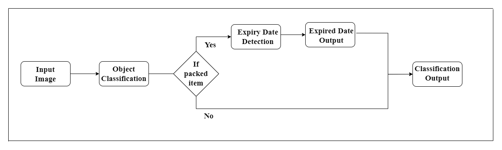  
    <em>Flow chart of the project </em>

 

# Data Collection and Preprocessing
The data for the project was obtained from 2 different sources:
1. The dataset for image classification was obtained from "The Freiburg Groceries Dataset"[6] which is a publicly available dataset containing 5000 RGB images of various food classes. For the first part of our project we will classify the images broadly into 5 labels: Fruits, Vegetables, Beverages, Snacks and Other
2. The dataset for date detection was obtained from "ExpDate" dataset[5] which is again a publicly available dataset. This dataset has images corresponding to real images of products with their expiry dates, few images which have only dates from real products and few images which have synthetic dates of various formats which will be used in the date detection part of our project

For all the images in our dataset, we first started with an image compresssion with the help of Principal Component Analysis (PCA)[7][8]. The dataset has very high quality images (approximately 1000 x 1000 dimensions - since each image had a different size) which will increase our model's training time. The real world test images could also be of poor quality and the model would perform better if trained on similar images. So in order to reduce the training time and increase the accuracy, we used Principal Component Analysis (PCA) technique using 50 components which captured around 98% of the variation in the Blue channel, 97.5% of variation in the Red channel and around 98% of the variation in the Green channel. 

An example of image compressed with the help of PCA is as shown below:

  	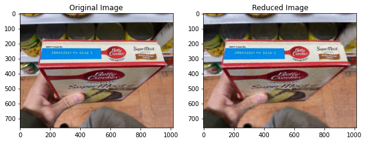 
    <em>Image Reduction with PCA </em>

 

To help tackle the problem of overfitting our model to the data-set in hand, we also tried to artificially expand our data-set by performing image augmentation on our original product images. We tried the following augmentation variations on our images:  
1) Left-Right flip  
2) Up-Down flip  
3) 90° flip  
4) 270° flip  
5) Saturation adjusted  
6) Brightness adjusted  
7) Gamma adjusted  

An example of the image augmentation performed on one of the images is as follows. 

  	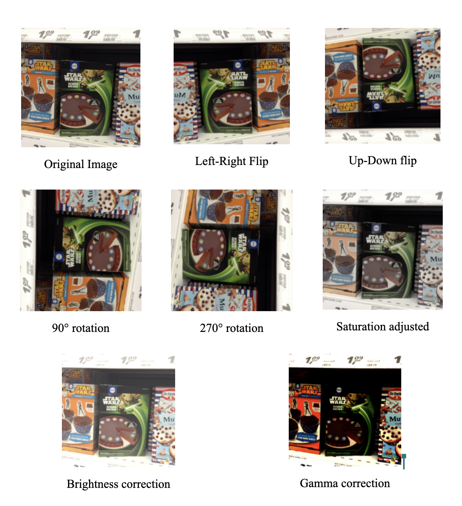 
    <em>Data Augmentation Example</em>

 

| No. | Class      | No.of images before augmentation | No.of images after augmentation |
|-----|------------|----------------------------------|---------------------------------|
| 1.  | Dairy      | 1412                             | 11296                           |
| 2.  | Fruits     | 2370                             | 18960                           |
| 3.  | Vegetables | 1306                             | 10448                           |
| 4.  | Snacks     | 1021                             | 8168                            |
| 5.  | Beverages  | 1591                             | 12728                           |
| 6.  | Others     | 2704                             | 21632                           |

 

# Method

## Object Classification Model
In our first part of the project, we have performed a image classification of the grocery images in our dataset. We split our original dataset of images into a training set and test dataset in the ratio of 4:1. As discussed earlier, we broadly classfied the images into 6 categories: Fruits, Vegetables, Snacks, Beverages, Dairy and Others.

  	 
    <em>Transfer Learning Framework </em>

 

The Object Classification model classifies the products into six different classes, Beverages, Fruits, Vegetables, Snacks, Dairy, Others using a supervised learning approach. This approach [10] uses Transfer Learning where the weights of the classification neural network are obtained from a pretrained model which in this case is the ResNet50 model trained on the ImageNet [2] dataset. Then ResNet50 is used on top of the custom CNN layer for classification. The ResNet50 architecture includes 48 Convolution layers along with 1 MaxPool and 1 Average Pool layer. ResNet50 is used here because it makes it possible to train ultra deep neural networks. A network can contain hundreds or thousands of layers and still achieve great performance due to residual networks. ResNets have a deep residual learning framework containing shortcut connections that simply perform identity mappings. The advantage of such identity mappings is that without any additional parameters added to the model and without increasing computational time, the performance is improved. Compared to other ResNets, ResNet50 has a few changes, the shortcut connections previously skipped two layers but now they skip three layers and presence of 1 x 1 convolution layers in between. 

  	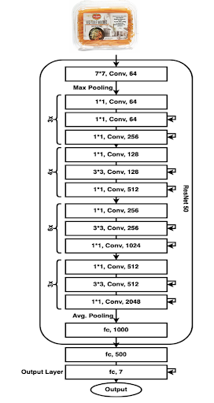  
    <em>ResNet50 model architecture used for Object Classification</em>

 

### Dealing With Overfitting
On training the ResNet-50 model with the initial dataset, overfitting was evident. Thus, to overcome overfitting various techniques were implemented.
1. Increasing the size of the training dataset: Various data augmentation methods such as left-right and up-down rotation, 90 degree and 270 degree flip, adjustments in saturation, brightness and gamma values in order to increase the dataset size.
2. Dropout regularization: Dropout layers were added in between the dense layers of the classification model. Dropout helps in removing or dropping certain inputs to a layer in order to make the network nodes more robust to the inputs.

### Fine Tuning Parameters
The batch size, learning rate and number of epochs were altered to check for the optimal values that led to improved classification accuracy. After much experimenting, the best values for these hyperparameters turned out to be:

<table>
  <tr><td>Batch Size</td><td>256</td></tr>
  <tr><td>Learning Rate</td><td>0.01</td></tr>
  <tr><td>Number of epochs</td><td>20</td></tr>
</table>

## Expiry Date Detection
Once we have the image classified, the next step would be to detect the probable bounding box of expiry date for a packed product and then extract the data from the bounding box. For the first task we used a supervised model for the localization of the bounding box where we used the ExpDate datasets which consists of packed products along with the coordinates of the bounding-box of dates. We used the VGG16 architecture for transfer learning. The architecture is as follows:

  	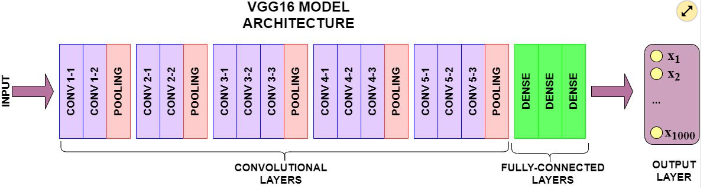 
    <em>VGG Architecture</em>

 

From this architecture we removed the fully-connected classification layer and introduced a new layer for our prediction task.

The first task in this process was to build the NN layer for performing the bounding-box detection. To perform this we first need to scale the input bounding-box coordinates between 0 and 1. The neural architecture consists of 4 neurons for each of the x and y coordinates of the top-left and bottom-right vertices. All these coordinates are passed into a Sigmoid activation function to perform the scaling in the range [0,1] as discussed above. Once this layer for detecting the box is built we will then insert it into the above architecture. For training the model, we freezed the convolution layer and only trained the full-trained layer to ensure that any previous features learned by the CNN are not destroyed and used a mean-squared error loss function on the training data-set. The newly added architecture is as shown in the image below:

  	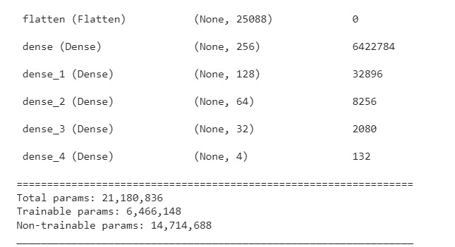 
    <em>Custom Layer on VGG</em>

 

An example of the prediction from the above model is as follows. In the below input image a product with the expiry date in focus is input into the prediction model:

  	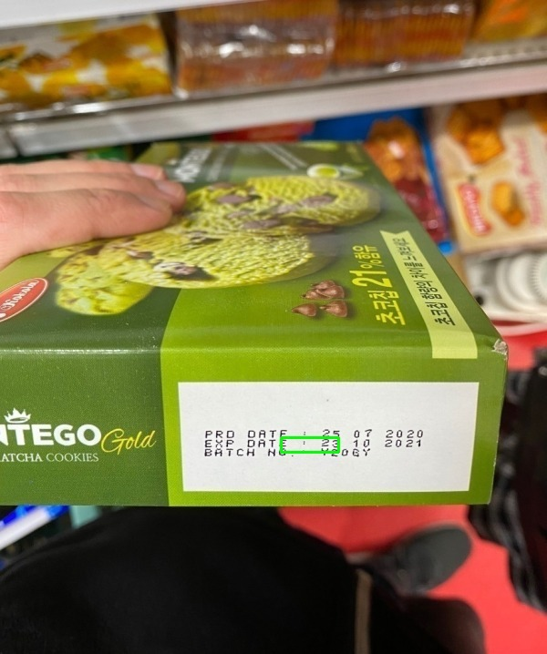 
    <em>Incorrect Output of Bounding Box Regression Model</em>

 

From the above example we can see that the bounding-box was not detected properly. To overcome this and make the model better, we have fine tuned various parameters of the model such as batch_size, optimized the hidden layers, number of neurons in the layers, activation functions for the neurons such as ReLu, TanH etc. to improve our prediction performance.

## Optical Character Recognition
From the previous step, we have the coordinates of bounding boxes where the expiry date is. We then crop the image to get the Region of Interest and converted the image to grayscale, then resized our image and applied morphological transforms to enhance the contrast of the pixels of the image. We then used EasyOCR to get the text from the image. 

  	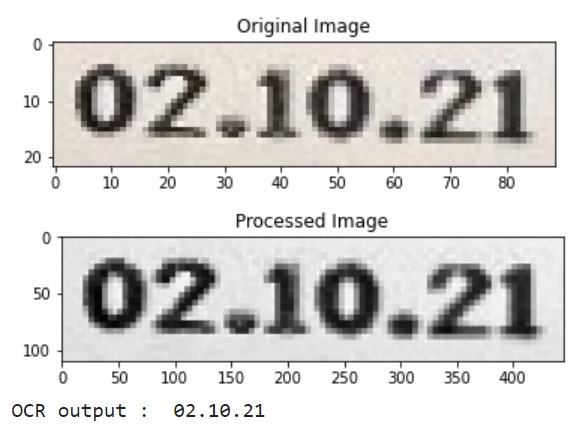 
    <em>OCR output </em>

 

## Integration 
The integrated model takes a test image as input which is then preprocessed according to the image size required by the classification and detection models. This image is passed to the classification model which outputs the category the object in the image belongs to. That is, first the model classifies the object into one of the six categories (Dairy, Fruits, Vegetable, Snacks, Beverages, Others) and if the image belongs to Dairy, Snacks or Beverages, that input image is tagged as belonging to the “Packed” category and is passed on to the expiry date detection model to generate the expiry date printed on the package. If the input image belongs to the other categories (Fruits, Vegetables and Others), then just the output of the classification model is displayed since there is no visible expiry date to detect. 

<!-- The aim of this project is to: 
* Identify the product using object classification (supervised learning) 
* Extract the expiry date information on the packages (unsupervised learning) 

This object classification task is an image classification task based on Transfer Learning. The base CNN model (ResNet-45) is pretrained on the ImageNet dataset (due to its 1000+ images each for an extensive list of classes) and the weights obtained are used in further training the ResNet model on the custom dataset.  -->

<!-- Using unsupervised learning, we can determine whether an item has expired or not by looking at images of the item. The full framework's architecture is depicted in Figure 1. Our framework is broken up into three sections. The feature extractor and the feature pyramid network (FPN) are used to extract the date region of the input image in the first section, which is referred to as date detection. The day, month, and year components are extracted from the date detection region, which is referred to as the Day-Month-Year Detection section. The third component is referred to as the Recognition Network, and this is where we apply the decoupling attention network (DAN) to recognize handwritten text.  -->

<!-- 

  	

 -->

# Results and Discussion
## Object Classification
The performance of the classification model is shown below with respect to its train and validation accuracy and loss. The training loss starts out to be around 0.45 and decreases to about 0.1 while the accuracy starts pretty high and gets better with each epoch. The accuracy of the model shows that the model is overfitting the data to an extent. This could mostly be due to the dataset. Image classification models require huge datasets and the original dataset used for this classification model was comparatively very small. Thus, increasing the size of the data before augmentation could be the key to fix the overfitting problem. Methods like standardization, regularization, addition of dropout layers when necessary and fine tuning of hyperparameters could help in improving the model’s performance further.

  	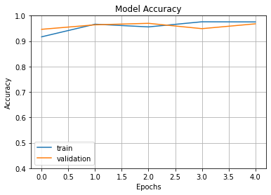  
    <em>Model accuracy performance on augmented dataset</em>

<!-- 

  	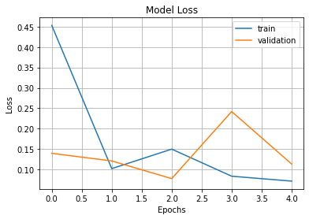  
    <em>Model loss performance on augmented dataset</em>

 -->
  

Evaluation metrics for the classification model:  
1) Training Accuracy: 97.55%  
2) Validation Accuracy: 96.80%  
3) Precision: 82.66%  
4) Recall: 98%  
5) F1 Score: 91.03%  

The below images show the sample outputs for some images for which the model predicts the right classes. However, for some images, the model failed to predict the right class which is to be expected from the overfitting problem. For example, the fourth image of apples in a supermarket is predicted to belong to the packed class by the trained model. For the particular use-case of expiry date detection, this image of apples would not be considered to be packed since it has no expiry date to detect. Thus, such edge cases should also be dealt with in the next half. 

  	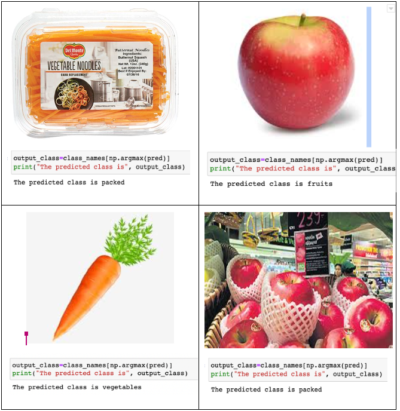  
    <em>Model classification performance on some samples</em>

 

## Improved Model
The initial problem of overfitting was handled through adding dropout layers and finetuning the model hyperparameters, especially batch size. The updated results show that there is an improvement in validation accuracy - to an extent it is more than training accuracy. Through increasing the batch size, we improve the model metric and also reduce the runtime per epoch - overall making the system more efficient that earlier. As shown in the graph below, the training and validation accuracies start at a lower value and increase steadily to reach a saturation point at around 20 epoch runs. The validation accuracy is about 0.5-1.0 more than the training accuracy throughout the epochs.
 

  	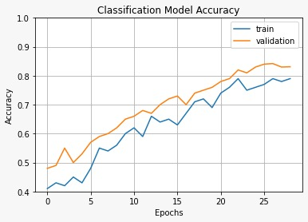  
    <em>Improved Model accuracy performance on augmented dataset</em>

 
The final evaluation metrics are:  
1) Training Accuracy: 79.77%  
2) Validation Accuracy: 83.15%  
3) Precision: 84.33%  
4) Recall: 92.50%  
5) F1 Score: 88.23%  

## Expiry Date Detection
After splitting the images from the ExpDate data-set into train and test sets in a ratio of 4:1, we trained the model using the architecture as detailed above on the train data-set. Later we tested the trained architecture on the test data-set. The Loss vs Epoch for both training and validation tests is as shown in the image below:

  	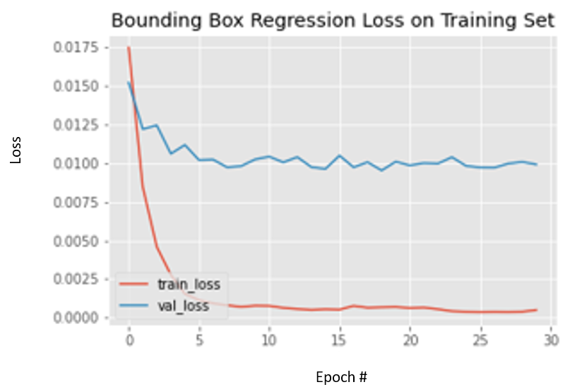  
    <em>Training and Validation loss for Date Area Detection</em>

 

The validation accuracy for the bounding-box regression model after hyper parameter tuning is 91.4%. This value was obtained for a batch-size of 16, relu activation function, and 30 epochs.

Few examples from the prediction model after running the images through the NN model and OCR model are as shown below:

  	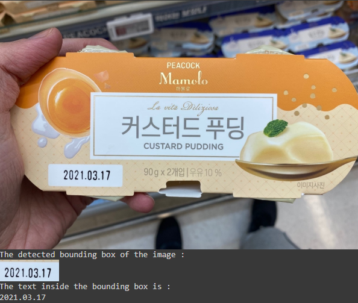  
    <em>Date detection on image with date in the format ‘YYYY.MM.DD’</em>

 

  	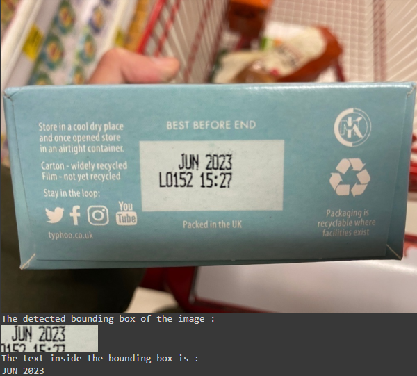  
    <em>Date detection on image with date in the format ‘MMM YYYY’</em>

 

  	  
    <em>Date detection on image with date in the format ‘DD.MM.YY’</em>

  

## Final Integrated Model Prediction
The final output of the combined system shows two things - the predicted class/category and the expiry date. If the image belongs to Beverage, Snack or Dairy categories, then the classification output is shown as 'Packed', otherwise it is shown as Fruits, Vegetables or Others. 
A few sample outputs are shown below:
 

  	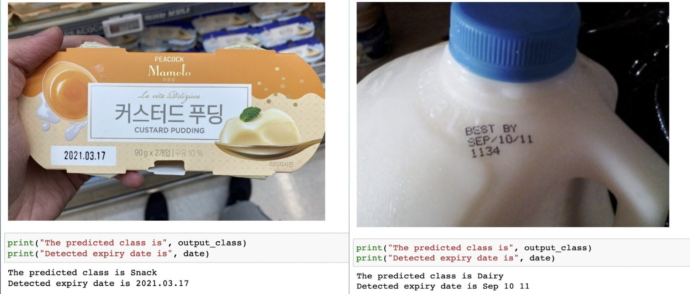  
    <em>Final Model prediction output on some samples</em>

  

<!-- Results include a comparative analysis of all classification models (ResNet-45/50/101, VGG-16, Inceptionv3, EfficientNet) trained and tested for identifying expiry dates and classifying items.  

Performance metrics used to evaluate the models will be balanced accuracy, precision, recall, f1-score, confusion matrix, ROC AUC and Top-k classification accuracy. 

A mobile application that demonstrates the working of the models could also be designed. Further, this work can be extended towards the development of a scanner that can help the visually impaired in a potential lifesaving situation – as in the case of detecting expired medicines.  -->
# Conclusion
Expiry date detection can be very helpful in many real-world scenarios. Either to aid the visually impaired or to just make it easier to read expiry dates which could be printed in various formats and fonts, implementing an automated date detector could be beneficial. This work utilized concepts of computer vision and regression models in order to detect the category of the object and then the expiry date printed on it. Initially, PCA was used to compress the images as part of unsupervised learning. A fine-tuned ResNet-50 model pretrained on the ImageNet dataset was used for the supervised object classification task while the VGG-16 regression model was used in order to produce bounding boxes to detect the region of the expiry date which was then generated as text output using OCR. Although the ResNet-50 model overfitted the data initially, adding dropout layers, tuning the hyperparameters and increasing the training data size using image augmentation helped in overcoming overfitting. This work could be extended to using more recent models such as AlexNet and InceptionNet for classification to see if there will be any performance improvement. 

# Reference
1. Ahmet Cagatay Seker, Sang Chul Ahn “A generalized framework for recognition of expiration dates on product packages using fully convolutional networks”, Expert Systems with Applications, Volume 203, 2022, 117310, ISSN 0957-4174, [https://doi.org/10.1016/j.eswa.2022.117310](https://doi.org/10.1016/j.eswa.2022.117310). 
2. Minyoung Huh, Pulkit Agrawal, Alexei A. Efros, “What makes ImageNet good for transfer learning?”, [https://doi.org/10.48550/arXiv.1608.08614](https://doi.org/10.48550/arXiv.1608.08614).
3. E. Peng, P. Peursum and L. Li, "Product Barcode and Expiry Date Detection for the Visually Impaired Using a Smartphone," 2012 International Conference on Digital Image Computing Techniques and Applications (DICTA), 2012, pp. 1-7, doi: 10.1109/DICTA.2012.6411673. 
4. Ashino, M., Takeuchi, Y. (2020). Expiry-Date Recognition System Using Combination of Deep Neural Networks for Visually Impaired. In: Miesenberger, K., Manduchi, R., Covarrubias Rodriguez, M., Peňáz, P. (eds) Computers Helping People with Special Needs. ICCHP 2020. Lecture Notes in Computer Science, vol 12376. Springer, Cham. [https://doi.org/10.1007/978-3-030-58796-3_58](https://doi.org/10.1007/978-3-030-58796-3_58).
5. Marcus Klasson, Cheng Zhang, Hedvig Kjellström, "A Hierarchical Grocery Store Image Dataset with Visual and Semantic Labels", [https://doi.org/10.48550/arXiv.1901.00711](https://doi.org/10.48550/arXiv.1901.00711)
6. Philipp Jund, Nichola Abdo, Andreas Eitel, Wolfram Burgard, "The Freiburg Groceries Dataset", [https://doi.org/10.48550/arXiv.1611.05799](https://doi.org/10.48550/arXiv.1611.05799)
7. Mudrová, Martina and Aleš Procházka. “PRINCIPAL COMPONENT ANALYSIS IN IMAGE PROCESSING.” (2005).
8. Nsang, Augustine & Bello, A.M. & Shamsudeen, Hammed. (2015). Image reduction using assorted dimensionality reduction techniques. 1353. 139-146.
9. Patel, Chirag & Patel, Atul & Patel, Dharmendra. (2012). Optical Character Recognition by Open source OCR Tool Tesseract: A Case Study. International Journal of Computer Applications. 55. 50-56. 10.5120/8794-2784.
10. Image classification : Tensorflow Core (no date) TensorFlow. Available at: [https://www.tensorflow.org/tutorials/images/classification](https://www.tensorflow.org/tutorials/images/classification) (Accessed: November 11, 2022).

# Gantt Chart and Proposed Timeline
[View File](https://gtvault-my.sharepoint.com/:x:/g/personal/rramachandra7_gatech_edu/Ecd-YPwCuFBDuvu44UX_7J0B0jfClvfIibe9kC5hi7yXXw?e=a2dXz0)

# Contribution Table

<table class="tg">
<thead>
  <tr>
    <th class="tg-7btt">Name</th>
    <th class="tg-7btt">Project Task</th>
  </tr>
</thead>
<tbody>
  <tr>
    <td class="tg-c3ow" rowspan="6">Shivanee Jaiswal </td>
    <td class="tg-0pky">Project Midterm Report </td>
  </tr>
  <tr>
    <td class="tg-0pky">Data collection and pre-processing </td>
  </tr>
  <tr>
    <td class="tg-0pky">Unsupervised learning - Image compression </td>
  </tr>
  <tr>
    <td class="tg-0pky">Bounding Box Regression Model</td>
  </tr>
  <tr>
    <td class="tg-0pky">OCR</td>
  </tr>
  <tr>
    <td class="tg-0pky">Final Presentation Slides and Video</td>
  </tr>
  <tr>
    <td class="tg-c3ow" rowspan="6">Reshma Ramachandra </td>
    <td class="tg-0pky">Project Midterm Report </td>
  </tr>
  <tr>
    <td class="tg-0pky">Literature review </td>
  </tr>
  <tr>
    <td class="tg-0pky">Supervised Learning - Product Classification </td>
  </tr>
   <tr>
    <td class="tg-0pky">Fine Tuning Classification Model</td>
  </tr>
  <tr>
    <td class="tg-0pky">Evaluation metrics </td>
  </tr>
  <tr>
    <td class="tg-0pky">Final Presentation Slides and Video</td>
  </tr>
  <tr>
    <td class="tg-c3ow" rowspan="6">Janavi Khochare </td>
    <td class="tg-0pky">Project Midterm Report </td>
  </tr>
  <tr>
    <td class="tg-0pky">Unsupervised learning - Image compression </td>
  </tr>
  <tr>
    <td class="tg-0pky">Literature Review </td>
  </tr>
  <tr>
    <td class="tg-0pky">Bounding Box Regression Model</td>
  </tr>
  <tr>
    <td class="tg-0pky">OCR</td>
  </tr>
  <tr>
    <td class="tg-0pky">Final Presentation Slides and Video</td>
  </tr>
  <tr>
    <td class="tg-c3ow" rowspan="6">Srikesh Reddy </td>
    <td class="tg-0pky">Project Midterm Report </td>
  </tr>
  <tr>
    <td class="tg-0pky">Data sourcing and cleaning for supervised learning </td>
  </tr>
  <tr>
    <td class="tg-0pky">Data collection and pre-processing </td>
  </tr>
  <tr>
    <td class="tg-0pky">Evaluation metrics </td>
  </tr>
  <tr>
    <td class="tg-0pky">Github Page</td>
  </tr>
  <tr>
    <td class="tg-0pky">Final Presentation Slides and Video</td>
  </tr>
  <tr>
    <td class="tg-c3ow" rowspan="6">Nikhil Viswanath </td>
    <td class="tg-0pky">Project Midterm Report </td>
  </tr>
  <tr>
    <td class="tg-0pky">Image augmentation </td>
  </tr>
  <tr>
    <td class="tg-0pky">Data collection and pre-processing </td>
  </tr>
  <tr>
    <td class="tg-0pky">Data sourcing and cleaning for supervised learning </td>
  </tr>
  <tr>
    <td class="tg-0pky">Fine Tuning Classification Model</td>
  </tr>
  <tr>
    <td class="tg-0pky">Final Presentation Slides and Video</td>
  </tr>
</tbody>
</table>
